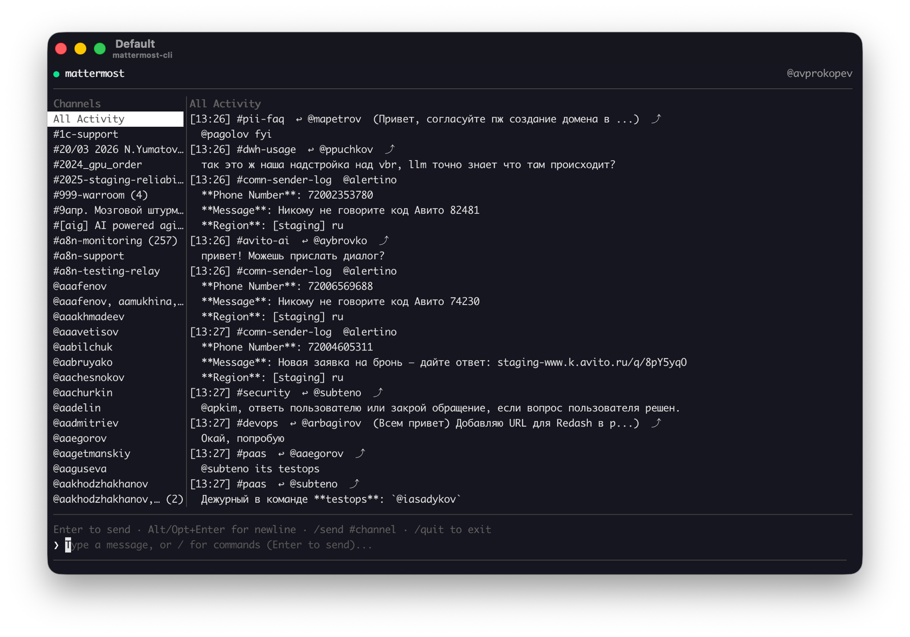
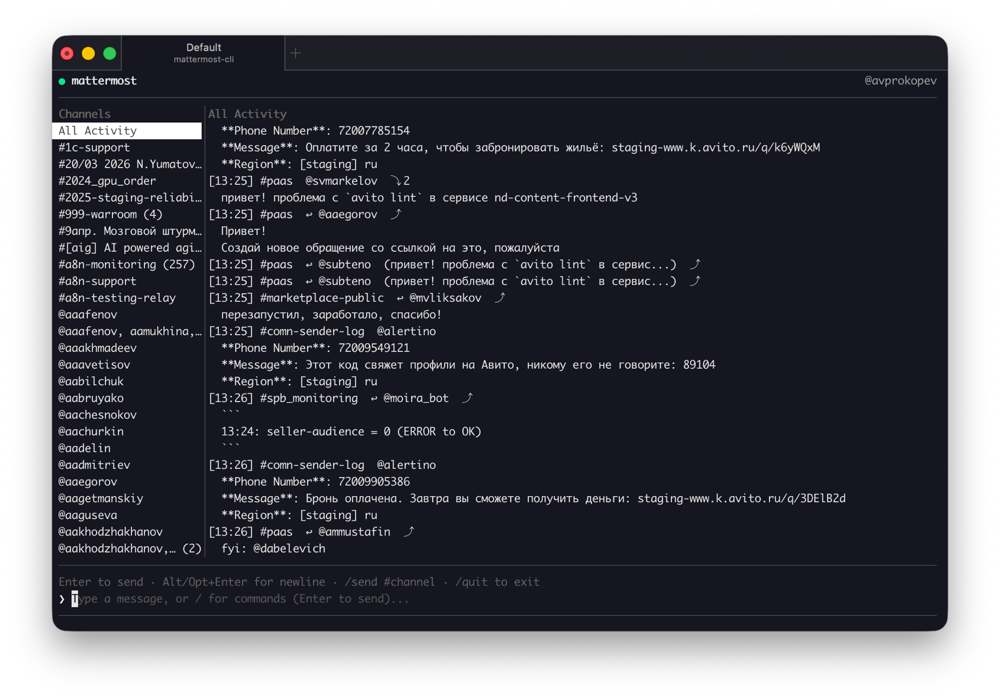
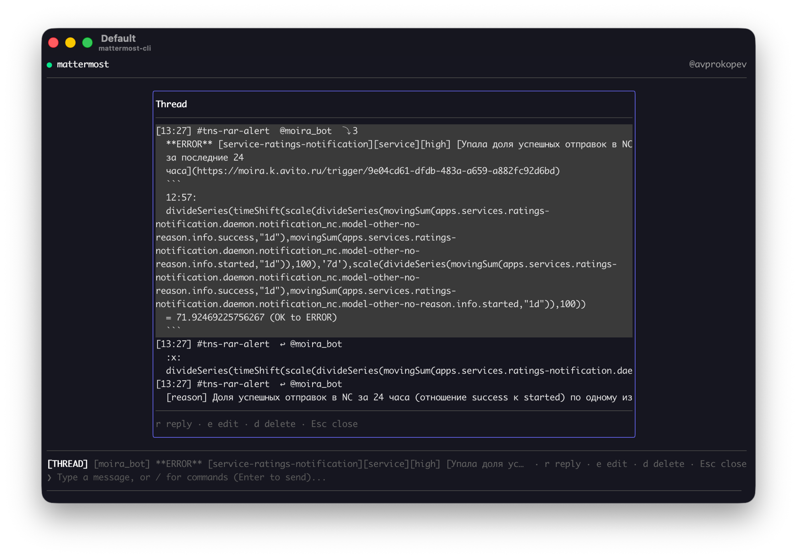
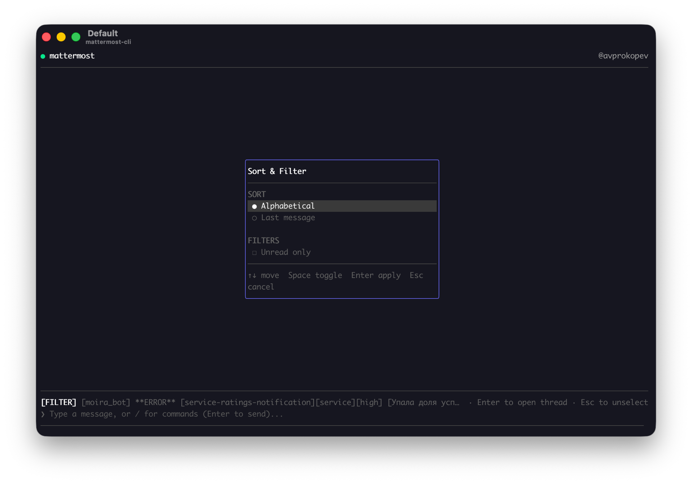

# mattermost-cli

A terminal TUI client for Mattermost, built with Go and [Bubble Tea](https://github.com/charmbracelet/bubbletea). Keyboard-driven, fast, with a local SQLite cache and an optional built-in Claude AI agent.



---

## Features

### Available now (M1 + M2)

**Channel navigation**
- Two-panel layout: channel list on the left, messages on the right
- Alphabetical sort or sort by last message — configurable via `Ctrl+K` sort popup
- Filter channels to unread-only
- Unread badge per channel (`#general (3)`), updated in real time via WebSocket
- Switching away from a channel marks it as read

**Messages**
- Unified "All Activity" feed — all channels in one chronological stream (M1 behavior)
- Per-channel view showing only root messages (thread replies hidden by default, configurable)
- Reply count badge (`⤵ 3`) on messages with threads; `⤴` badge on replies in All Activity
- Infinite scroll — older history loads automatically when scrolling to the top
- REST history on channel open + `/reload` for manual page load
- Local SQLite cache: messages survive restarts; thread parent snippets resolve even for old posts

**Thread panel**
- `Enter` on any message opens a thread popup overlaying the main view
- Full thread: root message + all replies, scrollable
- `r` — insert `/reply` and jump to input (popup stays open)
- `e` — pre-fill `/edit <text>` for your own messages
- `d` — stub for delete (coming in M3)

**Channel search**
- `Ctrl+K` opens a quick-search popup: type to filter channels and users in real time
- REST search kicks in after 2 characters; fewer shows all local channels
- `Enter` on a user opens a DM channel

**Connection**
- WebSocket reconnect with exponential backoff (max 60 s, ±20% jitter)
- Connection status always visible in the header

**Send messages**
- `/send #channel text` — send to a channel
- `/send @username text` — find or create a DM and send

**Navigation (keyboard-only, no mouse required)**

| Key | Action |
|---|---|
| `Ctrl+L` | Focus channel list |
| `Ctrl+J` | Focus message panel |
| `Ctrl+K` | Open channel/user search popup |
| `Ctrl+B` | Prefix key (tmux-style): `+←` channels, `+↑/→` messages, `+↓` input |
| `↑` / `↓` | Navigate channels (select only) or scroll messages |
| `PgUp` / `PgDn` | Fast scroll |
| `Enter` | Open channel / open thread |
| `Esc` | Return to input / close popup |
| `/` | Open command mode |
| `/quit` | Exit |

---

### Screenshots

**Channel list with unread badges and All Activity feed**



**Thread popup**



**Sort & Filter dialog (`Ctrl+K`)**



---

### Coming soon

**M3 — Message actions**
- Emoji reactions (`r` → `:emoji_code:`)
- Edit and delete your own messages
- Copy message text to clipboard (`y`)
- Message search (`Ctrl+F`)

**M4 — Extended commands**
- Create DM: `/dm @username`
- User search with autocomplete: `/find @prefix`
- Create channel: `/create-channel name [--private]`
- Full-text search: `/search query`
- OAuth 2.0 (browser flow) as an alternative to PAT

**AI agent (planned)**
- `Ctrl+A` opens an AI panel (Claude) at the bottom of the screen
- Claude sees the current channel context and messages from watched channels
- Tools: list channels, read history, switch channel, send/reply (requires confirmation)
- `/watch #channel` — subscribe channel to AI; `/unwatch` to remove
- All state-changing AI actions require explicit `y/n` confirmation

---

## Installation

### Requirements

- Go 1.24+
- A Mattermost server with API access
- A Personal Access Token (see [Mattermost docs](https://docs.mattermost.com/developer/personal-access-tokens.html))

### Build from source

```bash
git clone https://github.com/avalarin/mattermost-cli.git
cd mattermost-cli
go build -o mattermost-cli ./cmd/mattermost-cli
```

Or with [just](https://github.com/casey/just):

```bash
just build
```

---

## Configuration

Copy the example config and fill in your credentials:

```bash
cp config.example.toml ~/.config/mattermost-cli/config.toml
```

Minimal required config:

```toml
[server]
url   = "https://mattermost.example.com"
token = "your-personal-access-token"
team  = "my-team"   # team slug (the URL segment, not the display name)
```

Full config reference:

```toml
[server]
url   = "https://mattermost.example.com"
token = "your-personal-access-token"
team  = "my-team"

[ai]
api_key = ""               # or set ANTHROPIC_API_KEY env var
model   = "claude-sonnet-4-6"
enabled = false            # set to true to enable the AI panel

[ui]
date_format         = "15:04"       # or "2006-01-02 15:04"
message_limit       = 100
theme               = "auto"        # "auto" | "dark" | "light"
channels_width      = 22            # sidebar width in characters
show_mode_indicator = true

[colors]
active_header_bg = "237"            # ANSI 256-color or #RRGGBB
active_header_fg = "15"

[channels]
# sort = "alphabetical"             # "alphabetical" | "last_message"
# unread_only = false
```

Environment variables override config file values:

| Variable | Overrides |
|---|---|
| `MATTERMOST_URL` | `server.url` |
| `MATTERMOST_TOKEN` | `server.token` |
| `ANTHROPIC_API_KEY` | `ai.api_key` |

---

## Local storage

```
~/.config/mattermost-cli/
├── config.toml   # settings
├── db.sqlite     # message cache, channel list, AI history
└── debug.log     # written only with --debug flag
```

---

## Running

```bash
./mattermost-cli --config ~/.config/mattermost-cli/config.toml
./mattermost-cli --debug   # writes structured logs to debug.log
```

---

## Development

```bash
just check   # build + vet + test + lint
just run     # run with config.dev.toml
```

Copy `config.example.toml` to `config.dev.toml` in the project root and fill in your dev credentials. `config.dev.toml` is gitignored.

---

## Tech stack

| Layer | Technology |
|---|---|
| Language | Go 1.24+ |
| TUI | [Bubble Tea](https://github.com/charmbracelet/bubbletea) + [Lip Gloss](https://github.com/charmbracelet/lipgloss) |
| WebSocket | [coder/websocket](https://github.com/coder/websocket) |
| Local DB | [modernc.org/sqlite](https://gitlab.com/cznic/sqlite) (pure Go, no CGO) |
| Config | [BurntSushi/toml](https://github.com/BurntSushi/toml) |
| AI | [Anthropic Go SDK](https://github.com/anthropics/anthropic-sdk-go) |

---

## License

MIT
